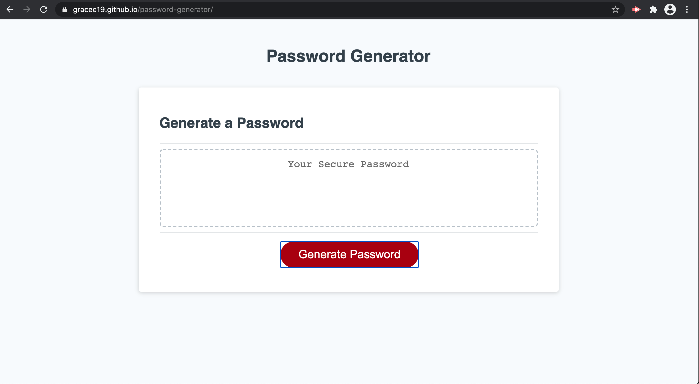
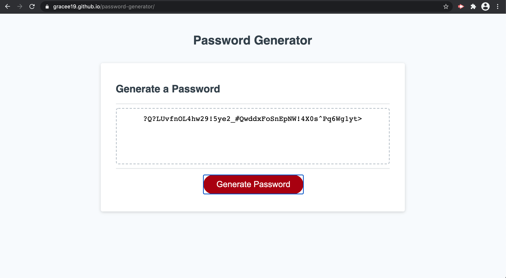

# password-generator

# Description

This project show how I can create a strong secure password generator using javascript. 

In this project I have created a password generator which is specifically have a length of 8 - 128 character.

It also shows if I added a uppercase,lowercase, number and special symbol.

In this project I learned to use arrays, var, functions, if else statement and event listener.

[DeployedApp](https://gracee19.github.io/password-generator/)

This photo show the main page of the password generator. Also it show my deployed application.

This photo show the generated password that the application give when I set the length of my password to 50 in which it has uppercase, lower case, number and special symbols
